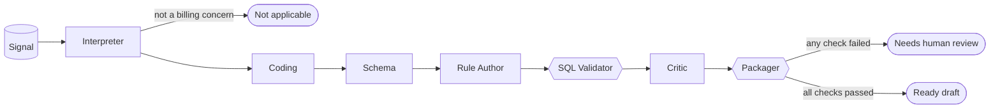
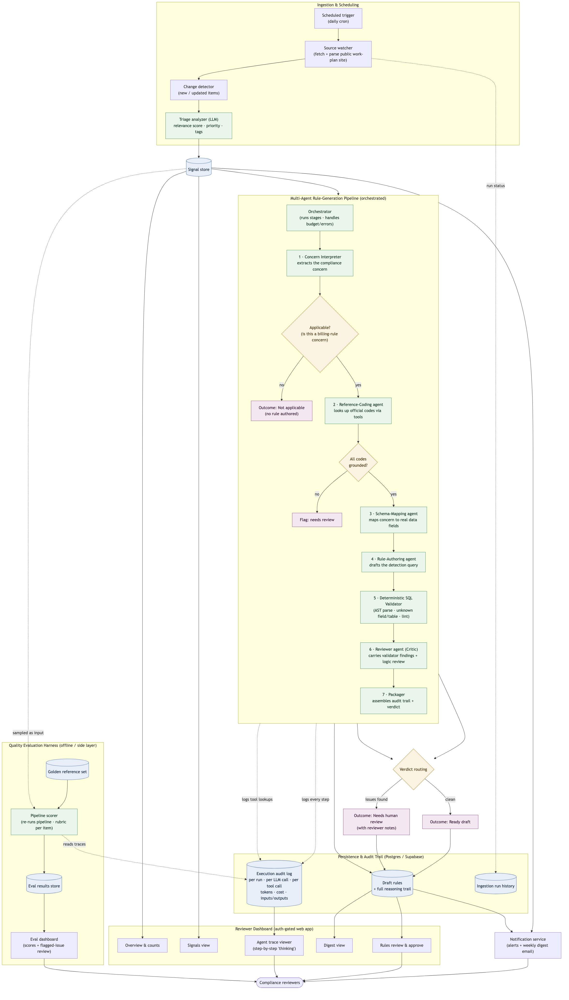

# Compliance Signal Monitor

**I designed and built a multi-agent LLM system that reads federal healthcare-audit updates, drafts SQL compliance rules, and verifies every rule before a human sees it.**

I built it as a software engineer at a Stanford StartX-accelerated healthcare AI startup. In production it monitored 249+ audit work-plan items for live healthcare operator customers.

### Results

- **Eval score raised from ~58 to ~87** on a 100-item golden set, after I traced a quality drop to false positives in the SQL validator and fixed them.
- **Human-review rate cut from ~52% to ~24%.** Most of the earlier flags were validator false alarms, not real problems with the rules.
- **About 90 seconds and 11 cents per signal**, end to end through all seven stages.

**Stack:** TypeScript · Next.js · Anthropic SDK (Claude, tool use) · Zod structured outputs · SQL AST parsing · Postgres / Supabase · GitHub Actions · Resend

> This repository contains the design docs and architecture diagrams for a production system. The implementation is proprietary and not included.

---

## The pipeline at a glance

Rectangles are LLM agents. Hexagons are deterministic code with no model involved.

---

## The problem

Healthcare compliance teams have to watch a public federal audit work plan, decide which updates matter to them, and turn each relevant one into a detection rule that runs against claims data. By hand, that work is slow, falls behind, and is hard to audit. This system automates the whole funnel and still keeps a person in control of every rule that ships.

---

## How it works

A daily job scrapes the work plan, detects new or changed items, and has a fast triage model score each one for relevance and priority. Items worth acting on become **signals**. Each signal then runs through seven stages:

| # | Stage | Type | What it does |
|---|---|---|---|
| 1 | **Interpreter** | LLM | Extracts the compliance concern and decides whether it is a claims-billing concern at all. If not, the run stops here. |
| 2 | **Coding** | LLM + tools | Looks up the relevant HCPCS, ICD-10, and DRG codes through lookup tools. A grounding check confirms every code came from a real lookup. |
| 3 | **Schema** | LLM | Maps the concern onto columns that actually exist in the claims schema. |
| 4 | **Rule Author** | LLM | Writes the detection SQL using only validated codes, validated columns, and approved shared logic fragments. |
| 5 | **SQL Validator** | Code | Parses the SQL into a syntax tree and rejects unknown tables, unknown columns, and hand-rolled logic that should use a shared fragment. |
| 6 | **Critic** | LLM | Keeps the validator's findings and adds only what a parser can't judge, such as scope drift and style. Returns typed issues. |
| 7 | **Packager** | Code | Assembles the full audit trail, sets the final verdict, and saves the draft rule for review. |

Every run ends in one of three outcomes:

- **Not applicable.** The item isn't a billing concern, so no rule is written. This is expected, not an error.
- **Needs human review.** Grounding failed or the Critic found issues. The rule is held with the specific reasons attached.
- **Ready draft.** Parsed clean, codes grounded, Critic passed. A person still gives final approval.

Full walkthrough: **[agentic-workflow.md](agentic-workflow.md)**

---

## Design decisions

**LLMs make judgments. Code does verification.**
Whether a column exists or a query parses is a yes/no fact, so a parser checks it, not a model. That catches hallucinated tables and columns with certainty and lets the Critic spend its effort on logic.

**The validator runs before the Critic.**
The model never pays to review SQL that doesn't parse, and it receives the validator's findings as settled facts instead of rediscovering them.

**The applicability gate comes first.**
Many work-plan items are about grants, IT security, or program administration and can never become billing rules. Filtering them in stage 1 means they exit before any expensive calls.

**An agent can't ship a code it didn't look up.**
The Coding agent must use lookup tools, and a post-check compares every code in its output against the tool calls it actually made. An invented code flags the run for review.

**Nothing is auto-approved.**
Three explicit outcomes, each decided by a concrete check. Uncertain output is escalated with reasons, never passed downstream quietly.

**Models are configured per agent.**
Each stage's model is set independently, so high-volume steps can stay on a small, fast model and only the steps that need deeper reasoning pay for a larger one.

**Everything is traceable.**
Every run, model call, and tool call is logged with tokens, cost, and full inputs and outputs. A reviewer can open any rule and replay exactly what each agent saw and said.

**Quality is measured, not assumed.**
An offline harness re-runs the pipeline against a golden set and scores each item on a rubric (completed, valid fields, query parses, Critic passed). Every eval run is stamped with the git commit and pipeline version, so any score change traces back to the exact code change that caused it.

---

## The fix behind the numbers

The eval score had stalled around 58, and about half of all rules were landing in human review. Reading the flagged runs, I found that many of them were valid rules the validator was wrongly marking as broken. Those false positives were sending good rules to review and pulling the score down.

I fixed the validator logic and locked the fix in with unit tests, including regression guards for hallucinated columns. The composite score rose to ~87 and the human-review rate fell to ~24%. The runs still flagged after the fix were real problems, which is exactly what review should catch.

---

## What I built

- The seven-stage agent pipeline, its orchestrator, and the typed handoff contracts between stages (Zod schemas)
- The deterministic SQL validator and the code-grounding check
- The evaluation harness, golden set, and eval dashboard
- The audit layer and the agent trace viewer
- The reviewer dashboard for signals, rule review and approval, and the weekly digest
- The daily ingestion job and the email alerts

---

## Full architecture

---

## Repository contents

| File | What it is |
|------|------------|
| [`agentic-workflow.md`](agentic-workflow.md) | Stage-by-stage walkthrough of the agent workflow |
| [`architecture-diagram.md`](architecture-diagram.md) | Architecture diagram (Mermaid source) with a written walkthrough |
| [`architecture-diagram.png`](architecture-diagram.png) / [`.svg`](architecture-diagram.svg) / [`.mmd`](architecture-diagram.mmd) | Rendered diagram in raster, vector, and Mermaid source |
