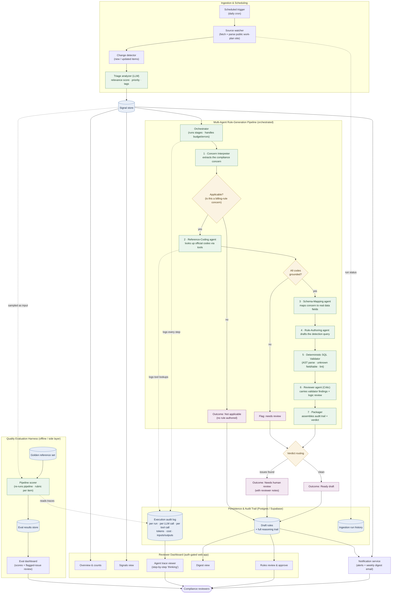

# Compliance Signal Monitor — Architecture & Workflow

A multi-agent system that watches a public healthcare-compliance work-plan source,
turns each new item into a prioritized signal, and drafts a reviewed, machine-checkable
compliance rule — with full audit traceability and an offline quality-evaluation harness.

> Portfolio note: this diagram shows components and data flow only. It contains no
> proprietary rule content, internal identifiers, schema details, or client names.

---

## System diagram

---

## How it works (interview walkthrough)

The system solves a slow, manual problem: compliance teams have to watch a government
work-plan source, figure out which updates matter, and translate each relevant one into
an actual detection rule that can run against claims data. This automates that whole
funnel while keeping a human firmly in the loop.

A scheduled job watches the source, detects genuinely new or changed items, and a fast
triage model scores each for relevance and priority — that's the cheap first filter.
Anything worth acting on becomes a *signal*.

The interesting part is the rule-generation pipeline. Instead of asking one model to do
everything, labor is split across specialized agents: one interprets the concern, one
looks up official codes (and is grounding-checked so it can't invent them), one maps the
concern onto real data fields, and one drafts the detection query. Crucially, a
*deterministic* validator parses that query and catches hallucinated fields or tables
before a reviewer agent ever weighs in — so the LLM critique focuses on logic, not
syntax.

What makes it non-trivial is the routing: an early applicability gate drops non-billing
items, code-grounding and critic checks escalate risky rules to human review, and only
clean drafts are marked ready. Every step — every model call, token, and cost — is logged,
so any output is fully traceable, and an offline eval harness scores the whole pipeline
against a golden set to catch quality regressions.

---

## Screenshot opportunities (capture before deletion)

Strongest visual portfolio pieces, roughly in order of impact:

1. **Agent trace viewer** (`/admin/agents/[id]`) — *the money shot.* Shows the pipeline
   "thinking": each agent's step, its parsed output, tool lookups, tokens, and cost for a
   single run. This is the clearest evidence of the multi-agent design and full traceability.
2. **Eval dashboard — run detail** (`/admin/evals/[id]`) — per-item rubric scores with the
   Critic's flagged issues rendered inline. Demonstrates evaluation rigor and honest
   quality measurement (rare in portfolios).
3. **Rules review page** (`/rules`) — draft rules with confidence/verdict and reviewer
   notes; capture one **ready** and one **needs-review** rule side by side to show the
   escalation logic.
4. **Main dashboard** (`/`) — overview counts, recent signals, and last-run status; good
   "at a glance the system is alive" hero image.
5. **Signals view** (`/signals`) — the prioritized feed, showing the triage layer's output.
6. **Terminal — batch run summary** (`npm run batch:test`) — the pass / needs-review /
   not-applicable breakdown with failure-pattern aggregation. Shows the pipeline running at
   scale and self-assessing.
7. **Terminal — eval score** (`npm run w9:eval`) — the composite score output; pairs well
   with screenshot #2.
8. **Eval dashboard — list** (`/admin/evals`) and **agent runs list** (`/admin/agents`) —
   supporting shots showing history/volume.

> Tip: for #1 and #2, pick a run that includes at least one **needs-review** outcome — a
> caught hallucinated field or a scope-drift note shows the guardrails working, which is
> more compelling than an all-green run.
